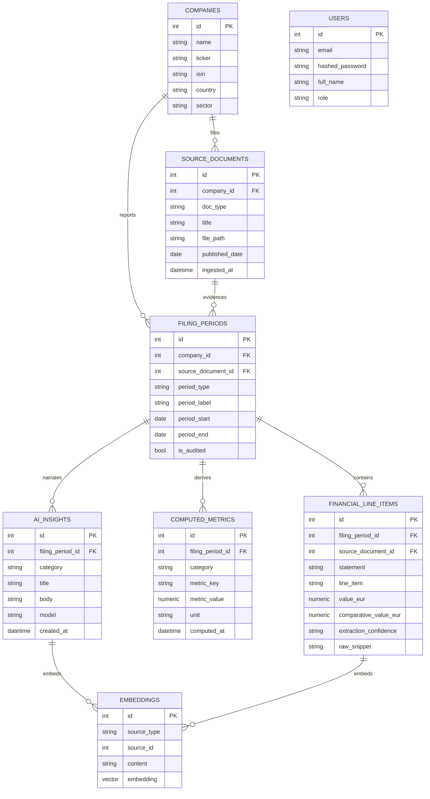

# Data model (ERD)

`filing_periods.period_type` is one of `HY` / `FY`. `financial_line_items.statement` is
one of `pnl` / `balance_sheet` / `cash_flow`. `computed_metrics.category` and
`ai_insights.category` are one of `growth` / `profitability` / `cash_liquidity` /
`solvency` / `returns`. `embeddings.embedding` is `vector(1536)` (pgvector) in Postgres;
on the SQLite dev fallback it degrades to a JSON-encoded float array and RAG retrieval
falls back to keyword lookup over `content` (see ADR 0002).
